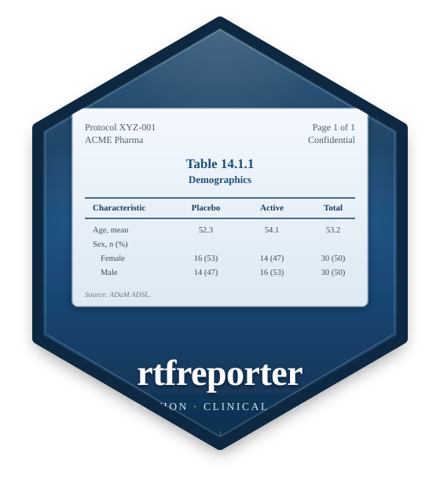

# rtfreporter



**A Python toolkit for clinical RTF Tables, Listings and Figures (TLFs).**

`rtfreporter` composes a Rich Text Format (RTF) document — the format regulators
and medical writers still expect — directly from tabular data, with **no
third-party RTF engine**. It is a faithful port of the R package
[`rtfreporter`](https://ichirio.github.io/rtfreporter/): same function names,
same arguments, same output.

- Multi-row **spanning column headers**, per-column formatting, and the clinical
  **TFL border** convention.
- Turn a **pandas** / **polars** DataFrame or a **great_tables** `GT` object into
  paginated pages with one call (`as_rtftables`).
- Running **headers and footers** with live page-number fields
  (`{AUTO_PAGE}`, `{AUTO_TOTAL_PAGES}`).
- **Titles and footnotes**, blank separator rows, `(Cont.)` continuation markers.
- Embed **PNG / JPEG figures** at their native DPI.
- **Assemble** several rendered reports into one deliverable with a table of
  contents.

## Install

```bash
pip install rtfreporter          # core (no hard dependencies)
pip install "rtfreporter[all]"   # + pandas, polars, great_tables
```

## Quickstart

```python
from rtfreporter import RtfDocument, rtf_header, rtf_footer

doc = (
    RtfDocument()
    .add_section(
        header=rtf_header([
            {"l": "Protocol XYZ", "r": "Page {AUTO_PAGE} of {AUTO_TOTAL_PAGES}"},
        ]),
        footer=rtf_footer([{"c": "CONFIDENTIAL"}]),
    )
    .add_table(
        {"Subject": ["001", "002", "003"], "Age": [34, 45, 28], "Sex": ["M", "F", "M"]},
        title=["Table 14.1", "", "Demographic Characteristics"],
        footnote=["Source: ADSL"],
    )
)

doc.save("demographics.rtf")
```

The same report written in the R package's functional style works too — see the
[Document API guide](document-api.md).

## Built on the R package

!!! info "Features land in R first"

    New functionality is designed and implemented in the
    [R package](https://ichirio.github.io/rtfreporter/), then ported here. The
    Python package does not add features of its own, so the two cannot drift
    apart.

    **Questions and usage discussion happen in one shared place:**
    [Discussions on the R repository](https://github.com/ichirio/rtfreporter/discussions).
    The Python repository keeps its own
    [issue tracker](https://github.com/ichirio/rtfreporter-py/issues) for
    defects specific to the port.

All 74 exported R functions exist here under the same names, and the worked
examples assert their figures against numbers produced by R. See
[Relationship to R](relationship-to-r.md).

## Where to next

<div class="grid cards" markdown>

- :material-rocket-launch: **[Get started](getting-started.md)**

    Install and a five-minute tour.

- :material-book-open-variant: **[Articles](articles.md)**

    The full guide index — page setup, borders, pagination, styling, assembly.

- :material-chart-box: **[Worked examples](showcase-dm.md)**

    Production-style demographics and adverse-event tables from real ADaM data.

- :fontawesome-brands-r-project: **[Relationship to R](relationship-to-r.md)**

    How the port is developed, and where to ask questions.

- :material-api: **[API reference](reference.md)**

    Every public symbol, grouped as in the R package.

</div>
